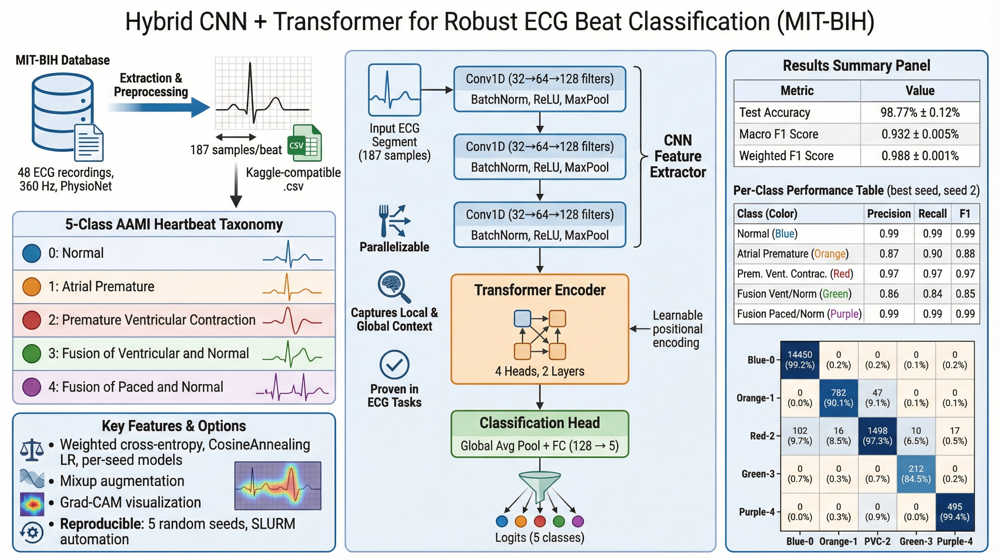
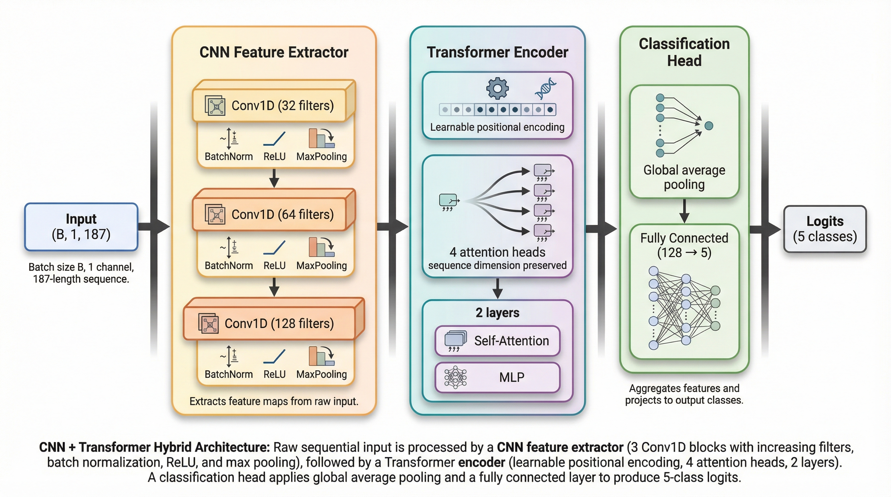

# Robust ECG Beat Classification on MIT-BIH

Automated classification of ECG heartbeats on the **MIT-BIH Arrhythmia Database** using a **CNN + Transformer** hybrid architecture. This repository achieves **98.77% test accuracy** and **0.932 macro F1** (mean over 5 seeds) on the 5-class AAMI heartbeat taxonomy.



## Highlights

- **State-of-the-art performance**: 98.77% accuracy, 0.932 macro F1 (stratified 80/15/5 split)
- **CNN + Transformer hybrid**: Combines local feature extraction with global temporal modeling via self-attention
- **Production-ready**: Weighted cross-entropy, CosineAnnealing LR, per-seed checkpoints, full metrics (precision, recall, F1)
- **Reproducible**: 5 seeds, SLURM job script, aggregate confusion matrices and reports

## Dataset

- **Source**: [MIT-BIH Arrhythmia Database](https://physionet.org/content/mitdb/1.0.0/) (PhysioNet), 48 half-hour ECG recordings at 360 Hz
- **Format**: 187 samples per beat (resampled from 360), compatible with Kaggle MIT-BIH heartbeat CSV
- **Classes** (AAMI taxonomy):

| Code | Label |
|------|-------|
| 0 | Normal |
| 1 | Atrial Premature |
| 2 | Premature ventricular contraction |
| 3 | Fusion of ventricular and normal |
| 4 | Fusion of paced and normal |

## Model Architecture

The **CNN + Transformer** hybrid consists of three stages:



### Why CNN + Transformer?

- **Parallelizable**: Self-attention processes all time steps in parallel; LSTM is strictly sequential.
- **Long-range dependencies**: Attention captures global temporal context without vanishing gradients.
- **Proven in ECG**: CNN+Transformer hybrids achieve strong performance on MIT-BIH in recent literature.

## Installation

```bash
git clone https://github.com/YOUR_USERNAME/ECG-Robust-Classification-mitbih.git
cd ECG-Robust-Classification-mitbih
pip install -r requirements.txt
```

**Requirements**: Python 3.9+, PyTorch ≥2.0, pandas, scikit-learn, matplotlib, wfdb, pyyaml, tqdm.

## Data Preparation

**Option 1** — Convert from PhysioNet + preprocessing (360 → 187 samples):

```bash
python src/download_data.py
python src/preprocess.py
python scripts/prepare_csv.py --from-pt
```

**Option 2** — Use Kaggle MIT-BIH heartbeat CSV:

```bash
python scripts/prepare_csv.py --from-kaggle-dir /path/to/dir/with/mitbih_train.csv
```

Output: `data/mitbih.csv` (columns 0–186 = signal, 187 = label).

## Training

**Local / single GPU:**

```bash
python train.py --config config
```

**Optional arguments:**

- `--seed N` — Random seed (default: 42)
- `--resume path/to/checkpoint.pt` — Resume from checkpoint

**SLURM (HPC):** Train 5 seeds (42, 1, 2, 3, 4) with automatic data setup:

```bash
sbatch run_cnn_transformer.job
```

Results are saved per seed: `results/checkpoints/cnn_transformer_seed{N}.pt`, `results/metrics_seed{N}.json`, `results/precision_recall_seed{N}.csv`, `results/figures/confusion_cnn_transformer_seed{N}.png`.

## Results

Evaluated on stratified 80/15/5 train/val/test split, 5 seeds, 100 epochs per seed.

### Summary (Mean ± Std)

| Metric | Value |
|--------|-------|
| **Test Accuracy** | 98.77% ± 0.12% |
| **Test Macro F1** | 0.932 ± 0.005 |
| **Test Weighted F1** | 0.988 ± 0.001 |

### Per-Seed Results

| Seed | Test Acc | Train Acc* | Val Acc* | Macro F1 |
|------|----------|------------|----------|----------|
| 42 | 98.82% | 99.50% | 98.75% | 0.9309 |
| 1 | 98.56% | 99.25% | 98.23% | 0.9254 |
| 2 | **98.87%** | **99.68%** | **98.80%** | **0.9395** |
| 3 | 98.76% | 99.52% | 98.77% | 0.9313 |
| 4 | 98.83% | 99.63% | 98.83% | 0.9338 |

*Last-epoch accuracy.

### Per-Class Performance (Best Seed, Seed 2)

| Class | Precision | Recall | F1 |
|-------|-----------|--------|-----|
| Normal | 0.99 | 0.99 | 0.99 |
| Atrial Premature | 0.87 | 0.90 | 0.88 |
| Premature ventricular contraction | 0.97 | 0.97 | 0.97 |
| Fusion of ventricular and normal | 0.86 | 0.84 | 0.85 |
| Fusion of paced and normal | 0.99 | 0.99 | 0.99 |

### Confusion Matrix (Aggregate, 5 Seeds)

Rows = true label, columns = predicted. See `results/confusion_matrix_cnn_transformer_report.md` and `results/figures/confusion_cnn_transformer_aggregate.png`.

## Outputs

| Path | Description |
|------|-------------|
| `checkpoints/best_model.pt` | Best checkpoint (val macro F1) |
| `results/metrics.json` | Test metrics (accuracy, F1, precision, recall) |
| `results/precision_recall_per_class.csv` | Per-class precision and recall |
| `results/confusion_matrix.png` | Test confusion matrix |
| `results/figures/confusion_cnn_transformer_*.png` | Per-seed and aggregate confusion matrices |
| `logs/train.log` | Training log |

## Optional Features

- **Mixup**: Set `mixup_alpha=0.2` in `config.py` for mixup augmentation.
- **Grad-CAM**: `python run_gradcam.py --checkpoint checkpoints/best_model.pt --output results/gradcam`

## Repository Structure

```
ECG-Robust-Classification-mitbih/
├── config.py              # CNN+Transformer hyperparameters
├── train.py               # Training entry point
├── run_gradcam.py         # Grad-CAM visualization
├── run_cnn_transformer.job # SLURM job (5 seeds)
├── models/
│   └── cnn_transformer.py # CNN + Transformer hybrid
├── utils/
│   ├── dataset.py         # ECG CSV dataset, dataloaders, Mixup
│   ├── metrics.py         # Accuracy, F1, precision, recall, confusion matrix
│   ├── losses.py          # Weighted CE, Focal Loss
│   ├── trainer.py         # Training loop, checkpointing
│   └── gradcam.py         # Grad-CAM for CNN+Transformer
├── scripts/
│   ├── prepare_csv.py     # Convert .pt or Kaggle CSV → 187-sample CSV
│   ├── plot_confusion_matrices.py
│   └── confusion_matrix_report.py
├── data/                  # MIT-BIH records, mitbih.csv
├── results/               # Checkpoints, metrics, figures
├── src/                   # LSTM/CNN baselines, download, preprocess, eval
├── configs/               # YAML configs for baselines
└── notebooks/             # EDA, visualization
```

## LSTM & CNN Baselines

This repo also includes LSTM and 1D-CNN baselines with inter-patient evaluation, robustness analysis, and learning curves. See:

```bash
python src/train.py --config configs/lstm_baseline.yaml --split inter_patient --seed 42
python src/robustness.py --model lstm --corruption gaussian
python src/stats.py
```

## Citation

If you use this code or results, please cite:

```bibtex
@misc{ecg-robust-classification-mitbih,
  title={Robust ECG Beat Classification on MIT-BIH},
  author={Iman Khazrak},
  year={2026},
  url={https://github.com/imankhazrak/ECG-Robust-Classification-mitbih}
}
```

## License

See [LICENSE](LICENSE) file.
